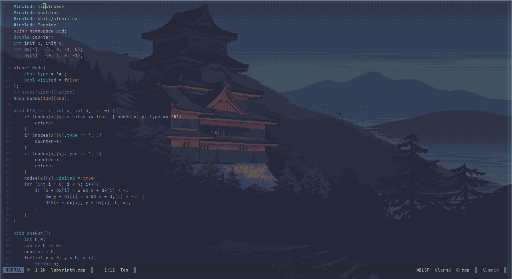

# neovim dotfiles

Pretty simple/straightforward dotfiles.

# Plugins
Some of the included plugins:
 - Telescope (+ dependencies)
 - Treesitter
 - nvim-cmp
 - nvim-lspconfig
 - mason
 - gitsigns and lazygit
 - Vimtex
 - lualine (lualine config at lua/statusline.lua)
 - whichkey
 - others...

 Note: the README might be out of date
