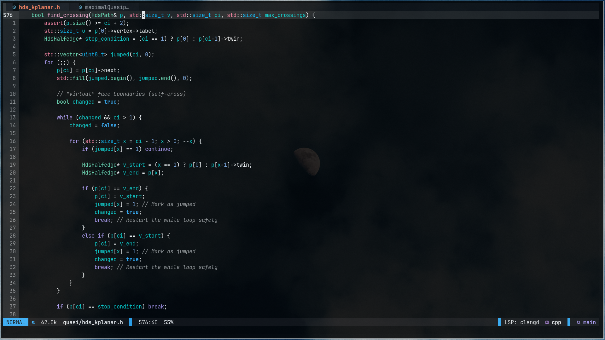

# neovim dotfiles

Pretty simple/straightforward neovim config.

Note: the README might be out of date

Note: Image is quite outdated

<!--  -->

## Directory Layout

```text
.
├── lua
│   ├── basic_config.lua
│   ├── keybindings.lua
│   ├── latexCompiler.lua
│   ├── lazy_bootstrap.lua
│   ├── lsp.lua
│   ├── treesitter.lua
│   └── plugins
│       ├── bufferline.lua
│       ├── general.lua
│       └── lualine.lua
└── init.lua
```

# Plugins
I use lazy.nvim as plugin manager.
Some of the plugins I use:
 - Telescope (+ dependencies)
 - Treesitter
 - nvim-cmp
 - mason / lspconfig
 - luasnip
 - lazygit and gitsigns
 - lualine (lualine config at plugins/lualine.lua)
 - others...

### Configuration Files

(Note: AI-generated table)

| File                     | Purpose                                   |
| ------------------------ | ----------------------------------------- |
| `basic_config.lua`       | General Neovim settings and options       |
| `keybindings.lua`        | Custom key mappings                       |
| `lazy_bootstrap.lua`     | Lazy.nvim bootstrap                       |
| `lsp.lua`                | LSP, Mason and completion configuration   |
| `treesitter.lua`         | Treesitter configuration                  |
| `latexCompiler.lua`      | Keybind to run latexmk and open zathura   |
| `plugins/general.lua`    | General plugins                           |
| `plugins/lualine.lua`    | Lualine statusline configuration          |
| `plugins/bufferline.lua` | Bufferline configuration                  |
