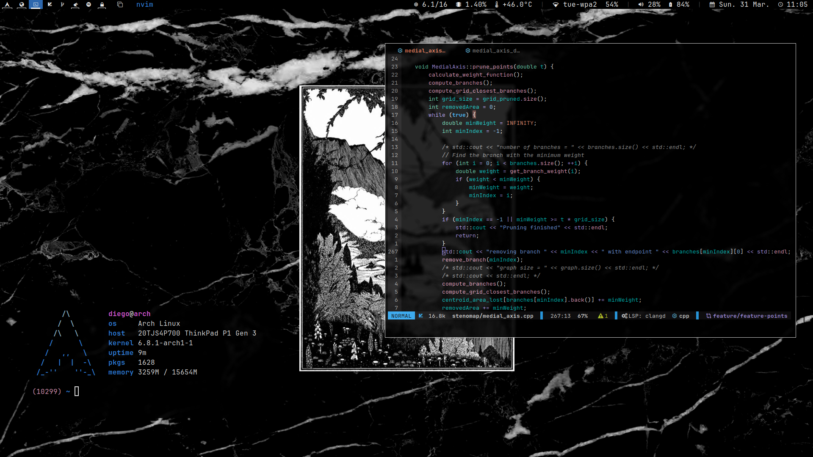
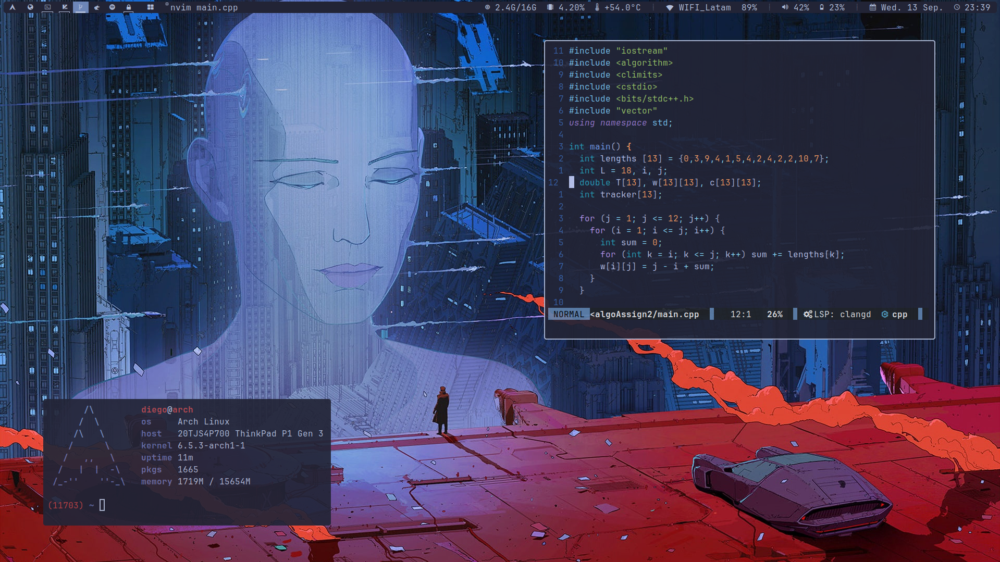
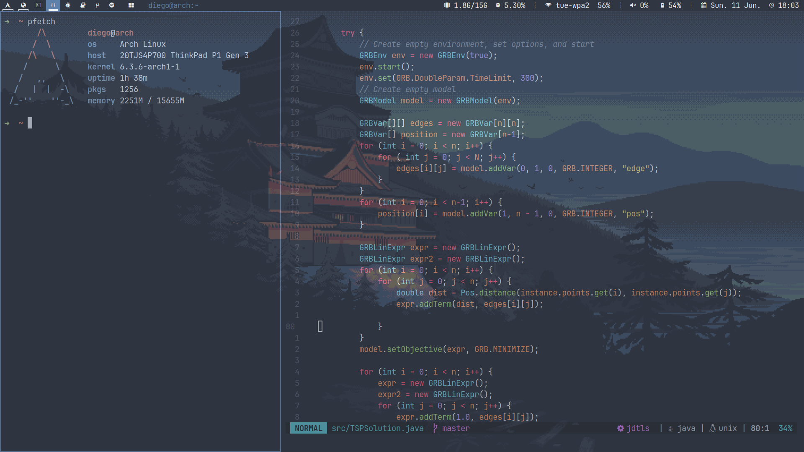
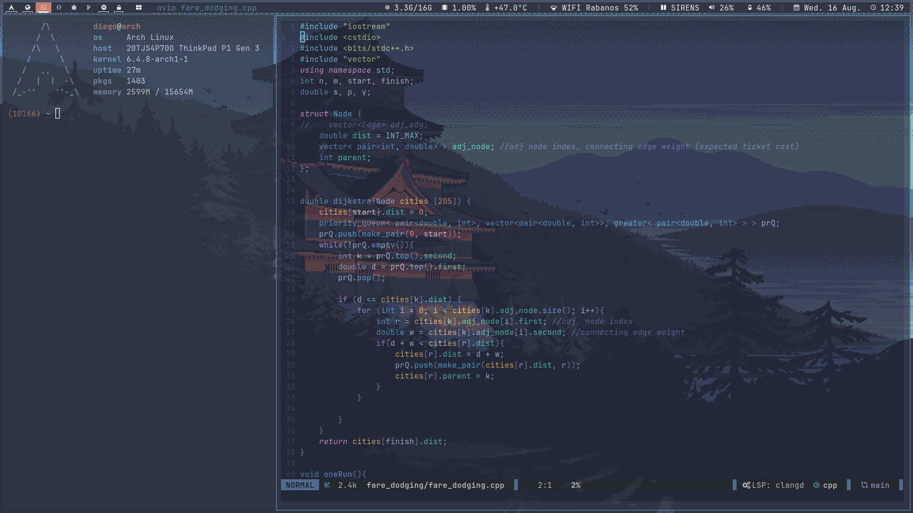
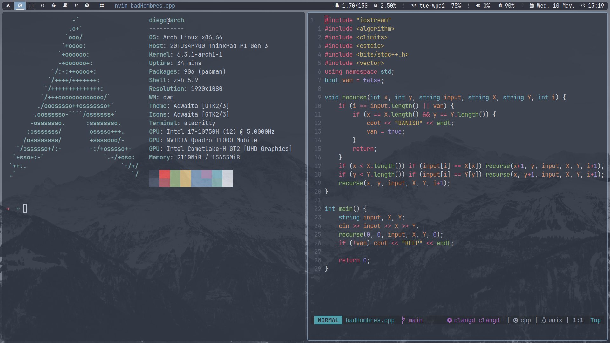

# dotfiles

Just my ***extremely*** simple dotfiles/setup.

Simply a bare-repo. Some of the configs:
 - [nvim](/.config/nvim) : ~/.config/nvim
 - [emacs](/.config/emacs) : ~/.config/emacs
 - [dwm](/.local/src/dwm) : ~/.local/src/dwm
 - [alacritty](/.config/alacritty) : ~/.config/alacritty
 - [zathura](/.config/zathura) : ~/.config/zathura
 - [picom](/.config/picom) : ~/.config/picom

The themes I have used over time, in order from most recent (current theme), to oldest.
It is possible to go back to the old themes by going back through the commit list, but it might 
be hard.
At the very least, going through past commits you should be able to find the color scheme.
Moreover, all the wallpapers can be found at the very messy directory [Pictures/wallpaper-master](/Pictures/wallpaper-master).

## Modus vivendi inspired theme:

## Bladerunner theme:

## Blue-orange theme:

Without gaps:

With gaps:

## Nord theme:

## Pink theme:

## Some dependencies

The dotfiles include, but are not limited to
- Neovim - version 0.10.0
- dwm - version 6.4
- dmenu - version 5.2
- alacritty - version 0.12.2
- zsh - version 5.9
- picom - version vgit-b700a
- rofi - version 1.7.5
