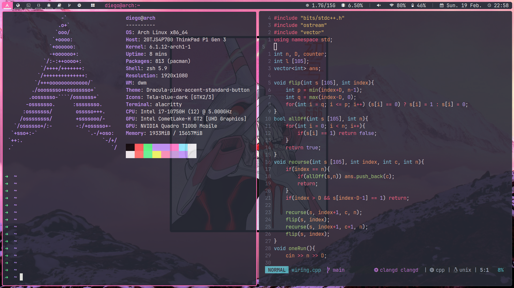

# dotfiles

Just my ***extremely*** simple dotfiles/setup.

The dotfiles include, but are not limited to
- Neovim - version 0.8.3
- dwm - version 6.4
- dmenu - version 5.2
- alacritty - version 0.11.0
- zsh - version 5.9
- picom - version vgit-b700a
- rofi - version 1.7.5
